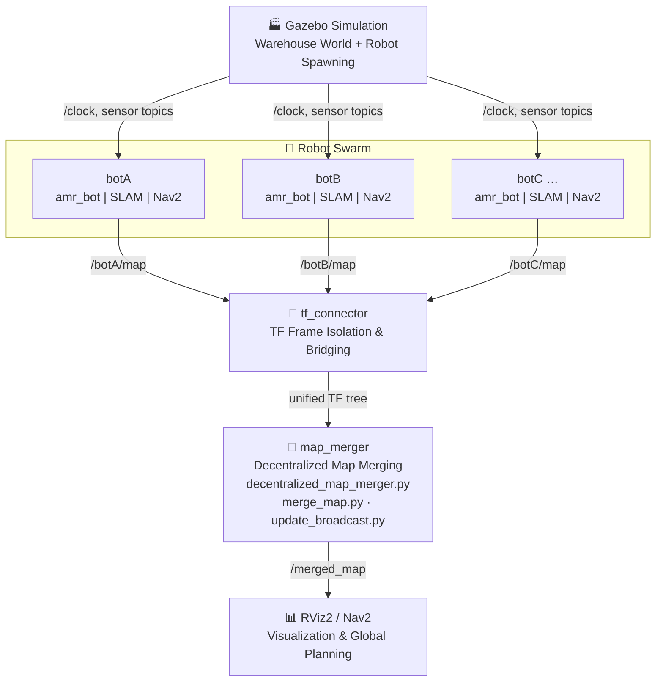

# Swarm SLAM — Multi-Robot Shared Mapping & Navigation

[](https://docs.ros.org/en/humble/)
[](https://gazebosim.org/)
[](LICENSE)
[](https://www.python.org/)

> **Research Publication:**  
> R. Balaji, *"Multi-Robot Systems: Shared Understanding of the Unknown Environment Through Swarm SLAM"*, ResearchGate, 2025.  
> 🔗 [Read the paper](https://www.researchgate.net/publication/397696513_Multi-Robot_Systems_Shared_Understanding_of_the_Unknown_Environment_Through_Swarm_SLAM)

---

## Table of Contents

1. [Overview](#overview)
2. [Key Features](#key-features)
3. [System Architecture](#system-architecture)
4. [Repository Structure](#repository-structure)
5. [Packages](#packages)
   - [amr_bot](#amr_bot)
   - [twowheelbot](#twowheelbot)
   - [slam_nav](#slam_nav)
   - [tf_connector](#tf_connector)
   - [map_merger](#map_merger)
6. [Prerequisites](#prerequisites)
7. [Installation](#installation)
8. [Usage](#usage)
9. [Configuration](#configuration)
10. [Demos](#demos)
11. [Research Paper](#research-paper)
12. [License](#license)

---

## Overview

**Swarm SLAM** is a ROS 2-based multi-robot system that enables a swarm of Autonomous Mobile Robots (AMRs) to collaboratively explore and map an unknown environment. Each robot independently runs SLAM (Simultaneous Localization and Mapping) and shares partial maps with its peers. A decentralized map-merging layer fuses these partial maps into a single, coherent global map — all without a central server.

The system is demonstrated in a realistic AWS RoboMaker warehouse simulation using Gazebo, featuring namespaced multi-robot coordination, TF frame isolation, Nav2 navigation, and SLAM Toolbox-based mapping.

---

## Key Features

- 🤖 **Multi-Robot Swarm Coordination** — Launch and manage multiple robots with unique namespaces in a shared simulation environment
- 🗺️ **Decentralized Map Merging** — Robots exchange and align partial occupancy-grid maps without a centralized authority
- 🔄 **TF Frame Isolation & Bridging** — Each robot maintains its own TF tree; a bridge node connects them all to a shared world frame
- 📡 **Online Async SLAM** — SLAM Toolbox in asynchronous mode for real-time mapping with loop closure
- 🧭 **Nav2 Navigation Stack** — Full autonomous navigation with AMCL localization, costmap layers, trajectory planning, and recovery behaviors
- 🏭 **Warehouse Simulation** — Realistic AWS RoboMaker warehouse world with shelves, pallets, walls, and lighting
- ⚙️ **Highly Configurable** — YAML-based parameters for robot spawn positions, SLAM settings, navigation tuning, and more
- 📊 **RViz Visualization** — Pre-configured RViz layouts for both default and multi-robot namespaced views

---

## System Architecture



---

## Repository Structure

```
Swarm-SLAM-Repo/
├── amr_bot/                  # AMR robot description & simulation
│   ├── designs/              # URDF/Xacro robot model files
│   ├── config/               # Controllers, twist mux, Gazebo params
│   ├── launch/               # RSP, Gazebo, RViz launch files
│   └── rviz/                 # RViz configuration files
│
├── twowheelbot/              # Alternative two-wheel robot platform
│   ├── designs/              # URDF/SDF/Xacro model files
│   ├── config/               # Controller & Gazebo configs
│   └── launch/               # Launch files
│
├── slam_nav/                 # SLAM & Navigation stack
│   ├── launch/               # Main, bringup, nav, SLAM launch files
│   ├── config/               # Nav2 params, SLAM Toolbox params
│   └── worlds/               # Gazebo warehouse world + models
│
├── tf_connector/             # TF frame management (C++)
│   └── src/
│       ├── worldframe_game.cpp    # Fixed frame broadcaster
│       └── multi_tf_bridge.cpp   # Multi-robot TF bridge
│
├── map_merger/               # Decentralized map merging (Python)
│   ├── map_merger/
│   │   ├── decentralized_map_merger.py
│   │   ├── merge_map.py
│   │   └── update_broadcast.py
│   ├── launch/               # Map merger launch files
│   └── config/               # RViz config for merged map
│
└── media/                    # Demo videos and recordings
```

---

## Packages

### `amr_bot`

The primary AMR (Autonomous Mobile Robot) package. Provides the robot description (URDF/Xacro), Gazebo simulation setup, ROS 2 Control integration, and RViz visualization.

| File | Description |
|------|-------------|
| `designs/amr.urdf.xacro` | Top-level robot URDF macro |
| `designs/lidar.xacro` | 2D LiDAR sensor plugin |
| `designs/ros2_control.xacro` | ROS 2 Control hardware interface |
| `config/my_controllers.yaml` | Differential drive controller |
| `config/twist_mux.yaml` | Velocity command multiplexer |
| `launch/robot_sim.launch.py` | Full Gazebo simulation launcher |
| `launch/rsp.launch.py` | Robot State Publisher launcher |

### `twowheelbot`

An alternative two-wheeled differential drive robot for testing and prototyping. Includes a saved warehouse map (`warehouse_twowheelbot_save`) for pre-mapped localization testing.

### `slam_nav`

The central SLAM and navigation integration package.

| Launch File | Purpose |
|-------------|---------|
| `main_launch.py` | Launches all robots with SLAM and Nav2 |
| `bringup_launch.py` | System bringup with topic remappings |
| `online_async_launch.py` | SLAM Toolbox in async mode |
| `localization_launch.py` | AMCL-based localization on a saved map |
| `navigation_launch.py` | Full Nav2 stack (planner, controller, recovery) |

Key configuration files:
- `config/nav2_params.yaml` — Nav2 parameters (AMCL, BT Navigator, DWB planner, costmaps)
- `config/mapper_params_online_async.yaml` — SLAM Toolbox parameters (Ceres solver, loop closing, scan matching)

### `tf_connector`

A C++ package that solves the TF namespace isolation problem in multi-robot setups.

| Node | Description |
|------|-------------|
| `worldframe_game` | Broadcasts a static transform from `world` to each robot's `odom` frame, preventing TF tree conflicts |
| `multi_tf_bridge` | Bridges each robot's isolated TF tree into the global world frame for unified map visualization |

### `map_merger`

The core contribution of this project — a decentralized, peer-to-peer map merging system written in Python.

| Module | Description |
|--------|-------------|
| `decentralized_map_merger.py` | Main ROS 2 node; subscribes to each robot's `/map` topic and triggers merging |
| `merge_map.py` | Implements the map alignment and occupancy-grid fusion algorithm |
| `update_broadcast.py` | Broadcasts incremental map updates to the swarm so peers stay in sync |

**How it works:**
1. Each robot publishes its partial occupancy grid on `/<namespace>/map`
2. The `map_merger` node subscribes to all robot map topics
3. `merge_map.py` aligns maps using overlap detection and merges cell-by-cell
4. The fused global map is republished on `/merged_map`
5. `update_broadcast.py` notifies peers of changes so they can re-request updates

---

## Prerequisites

- **OS**: Ubuntu 22.04 (recommended)
- **ROS 2**: Humble Hawksbill or Iron Irwini
- **Gazebo**: Gazebo Classic (gazebo11) or Ignition/Gz
- **Nav2**: `ros-<distro>-nav2-*`
- **SLAM Toolbox**: `ros-<distro>-slam-toolbox`
- **Python**: 3.8+
- **C++ Build**: `colcon`, `cmake >= 3.8`

Install ROS 2 dependencies:

```bash
sudo apt install \
  ros-$ROS_DISTRO-nav2-bringup \
  ros-$ROS_DISTRO-slam-toolbox \
  ros-$ROS_DISTRO-robot-state-publisher \
  ros-$ROS_DISTRO-joint-state-publisher \
  ros-$ROS_DISTRO-xacro \
  ros-$ROS_DISTRO-gazebo-ros-pkgs \
  ros-$ROS_DISTRO-tf2-ros \
  ros-$ROS_DISTRO-rviz2
```

---

## Installation

```bash
# 1. Create a ROS 2 workspace
mkdir -p ~/swarm_ws/src
cd ~/swarm_ws/src

# 2. Clone the repository
git clone https://github.com/0RBalaji/Swarm-SLAM-Repo.git

# 3. Install dependencies
cd ~/swarm_ws
rosdep install --from-paths src --ignore-src -r -y

# 4. Build the workspace
colcon build --symlink-install

# 5. Source the workspace
source install/setup.bash
```

---

## Usage

### Launch a Single-Robot SLAM Session

```bash
ros2 launch slam_nav main_launch.py namespace:=botA
```

### Launch Multi-Robot Swarm SLAM

The `main_launch.py` supports multiple robots with configurable namespaces and spawn positions:

```bash
ros2 launch slam_nav main_launch.py \
  namespace:=botA \
  x_pose:=3.0 y_pose:=2.5
```

To add more robots, spawn additional instances with different namespaces and positions (see `main_launch.py` for the full parameter list).

### Launch the Map Merger

```bash
ros2 launch map_merger mapmerger.launch.py
```

### Visualize the Merged Map

```bash
ros2 launch map_merger common_map.launch.py
```

### Localization on a Pre-built Map (No SLAM)

```bash
ros2 launch slam_nav localization_launch.py \
  map:=/path/to/your/map.yaml \
  namespace:=botA
```

---

## Configuration

### Changing the Number of Robots

Edit `slam_nav/launch/main_launch.py` — the default robots are defined as a list. Uncomment or add entries for `botB`, `botC`, `botD`, etc.

### Tuning SLAM Parameters

Modify `slam_nav/config/mapper_params_online_async.yaml`:
- `resolution` — map resolution (meters/cell)
- `max_laser_range` — maximum LiDAR range used for mapping
- `loop_search_maximum_distance` — maximum distance for loop closure candidates

### Tuning Navigation Parameters

Modify `slam_nav/config/nav2_params.yaml`:
- AMCL particle filter settings
- DWB local planner velocity/acceleration limits
- Costmap inflation radius and obstacle layers

### Using a Different Robot Model

Set `robot_pkg` in the launch arguments to switch between `amr_bot` and `twowheelbot`:

```bash
ros2 launch slam_nav main_launch.py robot_pkg:=twowheelbot
```

---

## Demos

Demo recordings are available in the `media/` directory:

| File | Description |
|------|-------------|
| `gazebiji.webm` | Full Gazebo warehouse simulation with robots navigating |
| `ajeeb_fin.webm` | Final implementation — swarm mapping in action |
| `changes_final.webm` | Incremental map merging demonstration |
| `working one.webm` | Early working prototype |

---

## Research Paper

This repository accompanies the following research publication:

> **R. Balaji**, *"Multi-Robot Systems: Shared Understanding of the Unknown Environment Through Swarm SLAM"*  
> ResearchGate, 2025  
> 🔗 [https://www.researchgate.net/publication/397696513_Multi-Robot_Systems_Shared_Understanding_of_the_Unknown_Environment_Through_Swarm_SLAM](https://www.researchgate.net/publication/397696513_Multi-Robot_Systems_Shared_Understanding_of_the_Unknown_Environment_Through_Swarm_SLAM)

The paper presents the theoretical foundations and experimental results of the decentralized Swarm SLAM approach implemented in this repository, covering:
- The decentralized map-merging algorithm and its convergence properties
- TF frame management strategy for multi-robot ROS 2 deployments
- Comparative evaluation of swarm vs. single-robot exploration efficiency
- Results from simulated warehouse environment experiments

---

## License

This project is licensed under the **Apache License 2.0** — see the individual package `LICENSE` files for details.

---

<p align="center">
  Built with ❤️ 🧠 using ROS 2, Gazebo, Nav2, and SLAM Toolbox
</p>
